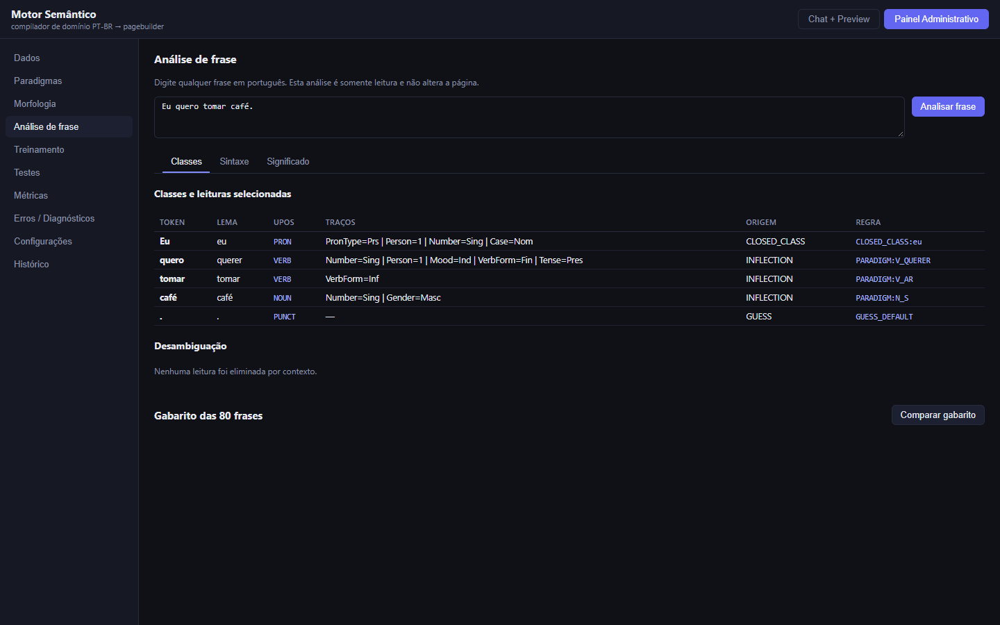
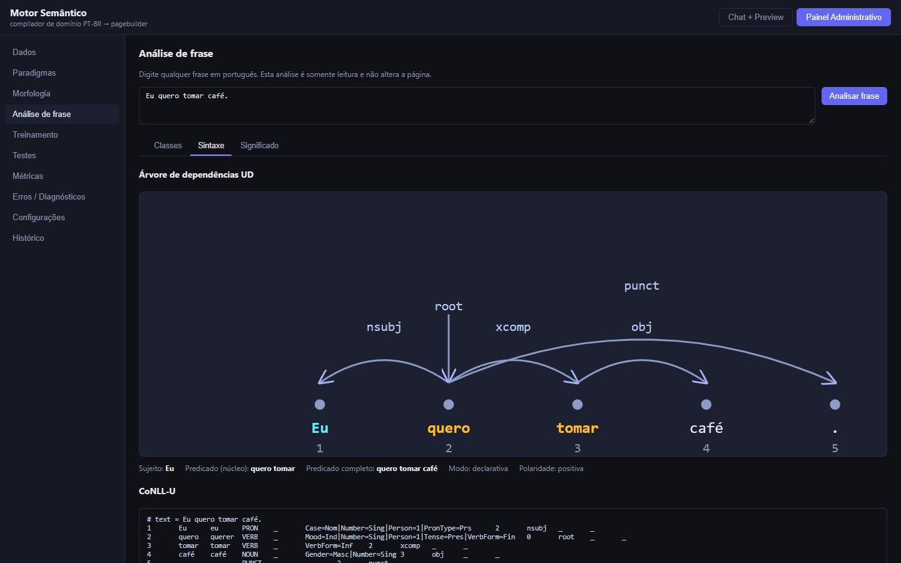
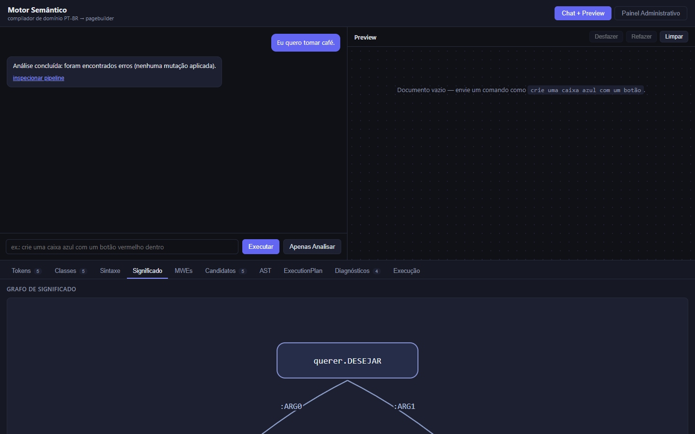
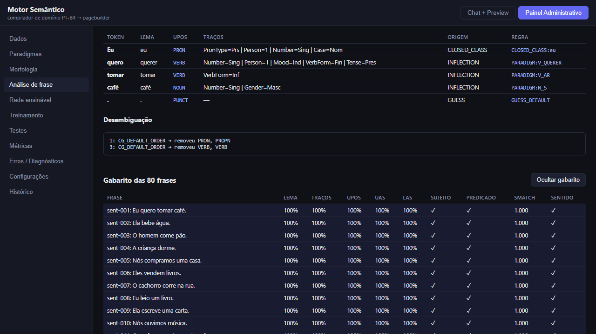
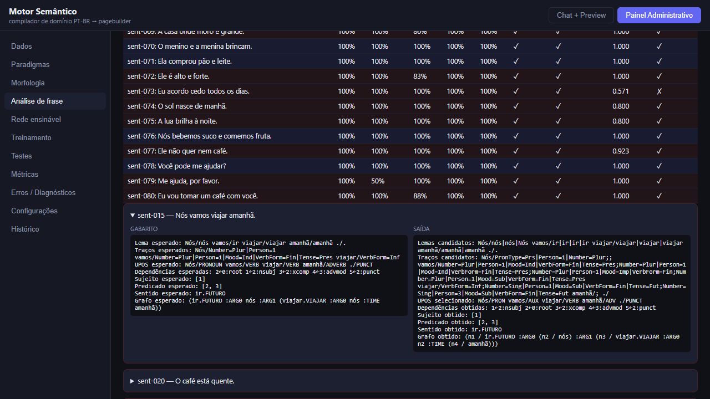
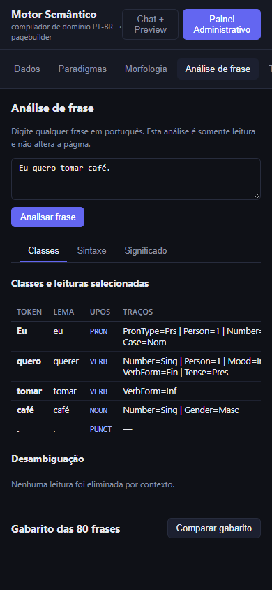
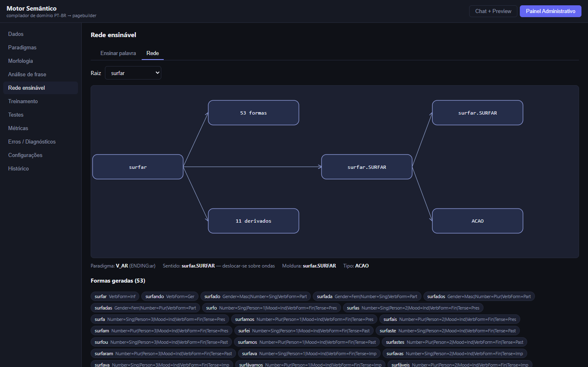
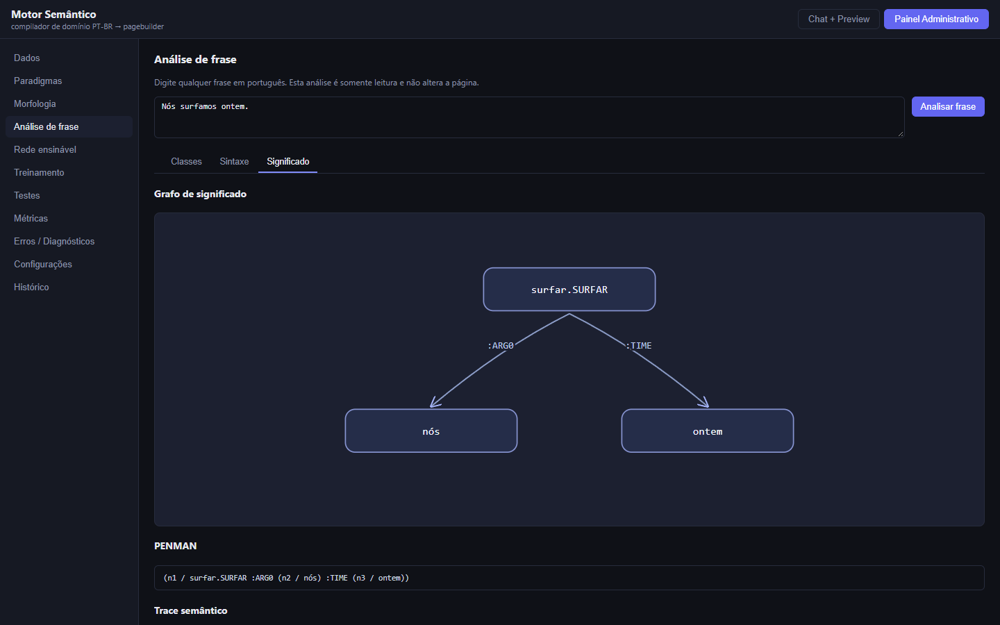
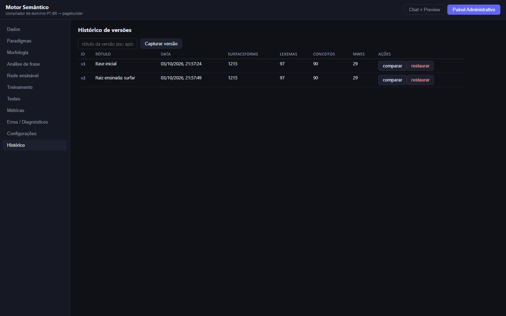

# Análise geral de frases do português

## Estado da entrega

Implementação na branch `codex/sintaxe-significado`, iniciada em `591733f` (`claude/morfologia-integrada`). A camada geral é somente leitura e não substitui o compilador de comandos do construtor. O exemplo **“Eu quero tomar café.”** produz `eu/PRON`, `quero/querer/VERB`, `tomar/tomar/VERB`, `café/café/NOUN`; sujeito `[1]`; núcleo do predicado `[2,3]`; predicado completo “quero tomar café”; e o mesmo nó `eu` em `:ARG0` de `querer.DESEJAR` e de `tomar.INGERIR`.

Linha de base antes das edições: `npm test` → **30 arquivos, 413 testes aprovados**. A última verificação completa está documentada abaixo. Os commits `TEST-EXPECTATION` foram deliberadamente vermelhos, conforme a escolha do solicitante; as correções `GOLD-FIX` de expectativas recém-adicionadas também ficaram vermelhas até o código correspondente, sem alterar o gabarito antigo. Os commits de implementação foram verificados em verde. As correções de expectativas estão justificadas em [CHANGES.md](research/morfologia/CHANGES.md).

## Fontes e decisões

| Fonte consultada | Decisão sustentada | Aplicação |
|---|---|---|
| [UD: classes UPOS](https://universaldependencies.org/u/pos/index.html), [NUM no português](https://universaldependencies.org/pt/pos/NUM.html), [traços](https://universaldependencies.org/u/feat/index.html) | Inventário `PRON`, `DET`, `ADP`, `AUX` etc.; cardinais são `NUM`, ordinais portugueses são `ADJ`; traços como `Person`, `Number`, `Mood`, `VerbForm`. | `closed-class.json`, `LanguageInflector.ts`, `LexicalAnalyzer.ts`, `Tagger.ts`. |
| [UD: relações](https://universaldependencies.org/u/dep/index.html), [cópula](https://universaldependencies.org/u/dep/cop.html), [xcomp](https://universaldependencies.org/u/dep/xcomp.html), [ccomp](https://universaldependencies.org/u/dep/ccomp.html), [nsubj](https://universaldependencies.org/u/dep/nsubj.html), [case](https://universaldependencies.org/u/dep/case.html), [amod no português](https://universaldependencies.org/pt/dep/amod.html) | Predicativo como raiz de oração copular; `xcomp` com controle obrigatório; complemento com sujeito próprio como `ccomp`; preposição dependente do nome; adjetivo atributivo dependente do substantivo como `amod`. | `DependencyParser.ts`, `ClauseAnalyzer.ts`. Cópulas e auxiliares em contexto recebem `AUX`, embora o gabarito local os chame de `VERB`. |
| [CoNLL-U](https://universaldependencies.org/format.html), [UD português](https://universaldependencies.org/pt/index.html), [Bosque](https://universaldependencies.org/treebanks/pt_bosque/), [PUD](https://universaldependencies.org/treebanks/pt_pud/) | Dez colunas e linha de faixa para contração; convenções portuguesas de artigos, contrações e clíticos. A forma feminina do artigo tem lema `o` no [Bosque](https://universaldependencies.org/treebanks/pt_bosque/pt_bosque-pos-DET.html). | `Tokenizer.ts`, `Conllu.ts`, `closed-class.json`, `contractions.json`. Bosque e PUD foram consultados, não copiados. |
| [Manual CG-3](https://edu.visl.dk/cg3/chunked/), [tutorial CG-3](https://edu.visl.dk/cg3_howto.pdf) | Coortes com múltiplas leituras e regras contextuais ordenadas `SELECT`/`REMOVE`. | `Tagger.ts`, `pos-rules.json`; cada remoção registra o ID da regra. |
| [Diretrizes AMR](https://github.com/amrisi/amr-guidelines/blob/master/amr.md), [AMR-PT](https://aclanthology.org/W19-4028/) | Papéis `ARG*`, controle como reentrância, polaridade, perguntas e adaptação de conceitos ao português. | `MeaningGraphBuilder.ts`, `adjunct-roles.json`, `implicit-pronouns.json`. |
| [Smatch](https://pypi.org/project/smatch/1.0.2/), [avaliação amrlib](https://amrlib.readthedocs.io/en/latest/evaluation/) | F1 de triplas de instância, relação e atributo com mapeamento de variáveis. | `graphMatch.ts` usa busca exata e determinística; não usa subida de encosta aleatória. |
| [PropBank-Br](https://aclanthology.org/L12-1114/), [VerbNet.Br](https://aclanthology.org/W11-4503/) | Referência conceitual para papéis e molduras verbais. | Os papéis são lidos apenas das molduras próprias do projeto; nenhum dado dessas bases foi importado. |
| [Alomorfia em adjetivos `-vel`](https://www.scielo.br/j/alfa/a/KBB8JSXYhkf3Wb6sXcbG9XJ/), [formação de palavras](https://www.scielo.br/j/delta/a/7TDJXwhYDpNRkXLYWhvnbnB/), [legível](https://www.aulete.com.br/legivel), [ouvir](https://www.aulete.com.br/ouvir), [destruição](https://www.aulete.com.br/destrui%C3%A7%C3%A3o), [escrever](https://www.aulete.com.br/escrever), [descrição](https://www.aulete.com.br/descri%C3%A7ao), [eleição](https://www.aulete.com.br/elei%C3%A7%C3%A3o), [divisão](https://aulete.com.br/divis%C3%A3o) | Alternâncias de radical e derivação por regras, com a ressalva de que certas ligações são históricas e não produtivas no português sincrônico. | `stem-rules.json` separa radical do sufixo e registra a fonte de cada família latina. Os exemplos de radical vieram do solicitante; as fontes indicadas sustentam a relação etimológica, sem terem sido importadas como dados lexicais. |
| [IndexedDB](https://developer.mozilla.org/en-US/docs/Web/API/IndexedDB_API), [cotas de armazenamento](https://developer.mozilla.org/en-US/docs/Web/API/Storage_API/Storage_quotas_and_eviction_criteria), [transações](https://developer.mozilla.org/en-US/docs/Web/API/IDBDatabase/transaction) | `localStorage` serve para dados menores; IndexedDB grava objetos estruturados em transações assíncronas e tem cota administrada separadamente pelo navegador. | `IndexedDbKnowledgeBaseBackend.ts` salva base, configurações, versões e treinamento em um registro transacional; o carregamento termina antes de montar a interface. |

## Arquitetura e comportamento

`SemanticEngine.analyzeSentence(text)` monta `Tokenizer → LexicalAnalyzer → Tagger → DependencyParser → ClauseAnalyzer → MeaningGraphBuilder`. A saída inclui leituras alternativas, escolha, traços, origem, regra, árvore UD, sujeito, dois recortes do predicado, modo, polaridade, CoNLL-U, nós/arestas, PENMAN e trace. O método não executa nem altera o documento. `DomainParser` não foi reescrito.

O parser usa **montagem determinística por padrões**: seleciona núcleo verbal ou predicativo, associa determinantes, adjetivos atributivos, casos, coordenação e orações, depois sujeitos, objetos e adjuntos. A escolha do sujeito combina posição com concordância de pessoa e número; um teste com objeto anteposto (“Eu, a casa comprei.”) verifica que o verbo de 1ª pessoa seleciona “Eu”. A relação é registrada com o ID da regra que criou o arco. Molduras do projeto agora distinguem no trace PP argumental de adjunto pela relação `obl`, preferência de tipo e preposição declarada em `frame-oblique-cases.json`; não alteram a relação UD, que é `obl` em ambos. Molduras `defaultTemplate` geram diagnóstico de incerteza. Essa escolha é compatível com as relações da UD citadas acima, embora construções ambíguas mais longas continuem abertas.

Definição operacional observada no gabarito: **predicado (núcleo)** é o verbo finito principal e sua cadeia `xcomp` ou verbo coordenado; em oração copular, é a cópula finita, embora o predicativo seja a raiz UD. Exemplo: `sent-001` usa `[2,3]` e `sent-021` usa `[3]`. **Predicado completo** é a subárvore da raiz sem a subárvore do sujeito e sem pontuação.

Os dados de classes fechadas, contrações, regras CG, alternâncias e papéis ficam em JSON. `src/` não contém dicionário, treebank nem molduras externas. Os 24 paradigmas propostos e 31 verbos irregulares copiados para `src/knowledge/language/` já pertenciam a `research/morfologia/` deste projeto; seis paradigmas adicionais em `seed-paradigms.json` corrigem famílias das raízes iniciais, como possessivos e centenas. A base ensinável usa formato de dados **v3**: uma raiz nova traz paradigma, regra de atribuição, glosa, tipo e moldura copiada de um modelo do próprio projeto. O **IndexedDB local** (`lexical.knowledgeBase`, loja `state`, chave `current`) é agora a fonte de persistência completa no navegador. A base antiga em `localStorage` é lida na primeira abertura e migrada sem apagar a cópia antiga; a pequena chave separada de raízes continua como fallback.

## Números medidos

As 80 frases do gabarito contêm 431 tokens para UPOS e dependências; as 20 extras, 78. A métrica lexical exclui pontuação (348 e 58 tokens). Os traços são medidos onde foram anotados (294 e 58 tokens).

| Métrica | Gabarito (80) | Extras (20) |
|---|---:|---:|
| Lema entre as candidatas | 348/348 (100%) | 58/58 (100%) |
| Traços entre as candidatas | 293/294 (99,66%) | 58/58 (100%) |
| Lema **e** traços na mesma leitura | 347/348 (99,71%) | 58/58 (100%) |
| UPOS selecionado | 419/431 (97,22%) | 77/78 (98,72%) |
| UAS | 431/431 (100%) | 78/78 (100%) |
| LAS | 431/431 (100%) | 78/78 (100%) |
| Sujeito exato | 80/80 (100%) | 20/20 (100%) |
| Predicado núcleo exato | 80/80 (100%) | 20/20 (100%) |
| Smatch F1 médio | 0,9703 | 0,9029 |
| Grafo exato (F1 = 1) | 70/80 (87,5%) | 12/20 (60%) |
| Sentido esperado presente | 77/80 (96,25%) | 19/20 (95%) |

Fase 1: os três casos de ruído, as dez palavras de radical latino fora dos dados e os dois comandos de domínio passaram. Fase 2: os 86 testes do arquivo de classes fechadas passaram, incluindo mesóclise, **151/151** raízes fechadas de palavra única e **48/48** numerais das raízes iniciais. Fase 3: **258/258** casos de flexão; **1.160/1.160** raízes iniciais e **97/97** lexemas do construtor têm leitura direta da forma-base; todas as raízes com paradigma declarado têm leitura flexional com traços. As atribuições incompatíveis foram corrigidas nos dados, dez formas de famílias antes ausentes foram verificadas e palpites de flexões finitas novas trazem classe e traços com origem `GUESS`. Fase 4: os limiares de UPOS foram atingidos; `SELECT`, `REMOVE` e desempate por ordem são rastreados. Fase 5: os limiares de UAS, LAS, sujeito e predicado foram atingidos; testes novos confirmam `amod`, modo interrogativo e sujeito posposto sem `?`, negação por pronome e por `nem`, ordem jussiva no subjuntivo sem sujeito, distinção de oblíquo argumental e análise determinística. Fase 6: os três limiares de grafo foram atingidos **no gabarito**; nas extras, grafos exatos ficaram em 60%, sem limiar exigido nessa fase. O desempate de sentido favorece a preferência exata de objeto concreto contra um ancestral genérico; “tomar café” não emite mais falso diagnóstico de empate. Há testes novos de controle pelo objeto, imperativo, pergunta, negação, cópula e coordenação em frases fora do gabarito. Complementos `xcomp` e `ccomp` recebem o papel indicado pela sintaxe da moldura, inclusive `ARG2` em causativos; a reentrância do objeto foi testada. O sujeito oculto de predicativo copular recebe `ARG1`, conforme a mesma regra do sujeito explícito. O trace indica o tipo preferido que decidiu o sentido e a moldura que atribuiu `ARG0`/`ARG1`, verificado também na vista renderizada. Fase 8: `surfar` gerou 53 formas e 11 hipóteses derivacionais na vista de rede; `surfista` aparece como `AGENT_OF(surfar)`.

## Falhas restantes e causas

- **Classe:** 12 tokens do gabarito (`sent-015`, `020`–`023`, `030`, `041`, `067`–`069`, `072`, `080`) e um das extras (`extra-019`) divergem porque a implementação marca cópula ou auxiliar como `AUX` conforme UD, enquanto os dados locais registram `VERB`. A árvore e o grafo desses casos continuam sendo avaliados. Não alterei o gabarito para aumentar a métrica.
- **Traços:** em `sent-079`, “ajuda” não tem, entre as leituras lexicais, a combinação `Mood=Imp|Person=3` do gabarito; o paradigma regular oferece 3ª pessoa do indicativo e 2ª do imperativo. O modo imperativo da oração é inferido estruturalmente.
- **Dependências, sujeito e predicado:** nenhuma divergência nos 80 casos e nas 20 extras medidos. Esse resultado não demonstra cobertura de todas as construções do português.
- **Grafo no gabarito, dez não exatos:** `sent-057`, `060`–`062`, `064`, `066`, `073`–`075`, `077`. Três têm sentido diferente (`061`, `064`, `073`): o gabarito usa `achar.CRER`, `ficar.FICAR` e `acordar.ACORDAR`, enquanto as molduras/raízes atuais do projeto usam `achar.CONSIDERAR`, `ficar.PERMANECER` e `acordar.DESPERTAR` nesses contextos. Nos demais casos faltam argumento implícito, quantificação/frequência ou há divergência de papel da moldura (`ter.CONTER`, sujeitos inanimados) e de tratamento do auxiliar futuro. As notas por frase e o diff estão no painel administrativo.
- **Grafo nas extras, oito não exatos:** `extra-001`, `002`, `005`, `010`, `013`–`015`, `018`. Parte da diferença vem de grafos extras redigidos com forma plural de superfície onde o motor usa lema. `extra-005` usa `dançar.DANÇAR` na anotação extra, enquanto a raiz do projeto identifica o sentido como `dançar.DANCAR`; o contador de sentido registra a divergência. Mantive a anotação para não ajustar o conjunto depois de ver a saída.
- **Persistência sob cota:** com 4,5 MB de preenchimento isolado em `localStorage`, ensinar `surfar` gravou a raiz e duas versões completas no IndexedDB. Após recarga, a interface exibiu a versão “Raiz ensinada: surfar”, sem erro; a cópia antiga do `localStorage` continuou intacta. O limite residual é a indisponibilidade, bloqueio ou esgotamento da cota do próprio IndexedDB; nessa situação o fallback local informa a falha e não promete histórico completo.
- **Generalização ainda aberta:** molduras genéricas (`defaultTemplate`) são marcadas como incertas; nomes compostos ambíguos, construções elípticas e alguns sentidos sem moldura distinta ainda podem falhar em frases novas. A busca exata de Smatch cresce combinatoriamente para grafos grandes.

## Interface e capturas

No Chrome local, `http://127.0.0.1:5173/`, foram verificados: chat → “Eu quero tomar café.” → Classes/Sintaxe/Significado; painel → texto livre; lista de 80 frases com métricas e diff; cinco frases do gabarito e cinco frases novas; ensino de `surfar`, análise de “Nós surfamos ontem.” e restauração após recarga. A vista móvel foi ajustada após uma captura revelar a navegação lateral larga. O primeiro carregamento expôs um favicon ausente (404); foi adicionado `public/favicon.svg`. Na sessão limpa final, o ícone respondeu `200` e não houve erros ou avisos no console. Após as mudanças recentes, a análise do exemplo foi conferida outra vez no Chrome pela porta local 5174: classes, árvore, sujeito, predicado completo e reentrância no PENMAN; cinco frases do gabarito e cinco frases novas mostraram grafo e trace sem erro no console. O painel foi novamente aberto no Chrome: exibiu 80 linhas e as nove métricas pedidas; o diff expandido mostra valores esperados e obtidos de lema, traços, UPOS, dependências, sujeito, predicado, sentido e grafo, sem erro de console. O plugin Browser não estava disponível; foi usado Playwright já presente no ambiente com Chrome local, sem instalação.

O novo armazenamento foi verificado no Chrome com o `localStorage` quase cheio: o IndexedDB confirmou uma transação com duas versões e a raiz `surfar`; a recarga preservou ambos. A aplicação não requer servidor SQL nem dependência nova para esse cenário local.

## Conferência dos critérios de pronto

| Critério | Evidência nesta entrega |
|---|---|
| Suíte antiga e nova, TypeScript e build | Saída dos três comandos na seção seguinte; os testes antigos continuam na suíte. |
| Limiares no gabarito e nas extras | Tabela de números medidos acima e saídas impressas por `language-inflection`, `language-tagger`, `language-dependencies` e `meaning-graph`. Os dez grafos não exatos permanecem identificados. |
| Exemplo completo e gabarito no painel | Verificação no Chrome de classes, sujeito, predicado, árvore e PENMAN com o mesmo nó `eu` nos dois `ARG0`; 80 linhas com nove métricas e diff aberto; capturas das vistas e do diff. |
| Nenhuma forma lexical portuguesa literal no TypeScript geral | Teste específico em `tests/architecture.test.ts` inspeciona todos os `.ts` de `src/engine/language/` contra formas do léxico, classes fechadas e domínio. |
| Nenhuma base externa ou dependência de runtime nova | Paradigmas e irregulares em `src/` têm o mesmo conteúdo SHA-256 dos arquivos de `research/morfologia/` já fornecidos; os demais JSON foram digitados para as regras desta entrega. `package.json` não mudou desde `591733f`. Busca no motor geral não encontrou chamadas `fetch`, `XMLHttpRequest` ou `WebSocket`; URLs em radicais são apenas referências. |
| Comandos do construtor preservados | Suíte de 413 testes de partida permanece integrada e verde; os testes de domínio e de arquitetura continuam aprovados. A única alteração funcional do domínio é `DERIVED_MATCH`, testada. |
| Relatório e histórico | Falhas e causas na seção anterior; `CHANGES.md` registra as correções de expectativa; commits `TEST-EXPECTATION` precedem as implementações na branch solicitada. |

## Verificação final

Saída observada após reconhecer perguntas sem pontuação e ordens jussivas: `npm test` → **39 arquivos aprovados, 587 testes aprovados (587)**, sem falhas; `npx tsc --noEmit` → código de saída `0`; `npm run build` → código de saída `0`, 129 módulos transformados, bundle principal de 1.236,73 kB. O Vite emitiu aviso de chunk acima de 500 kB; o limite não foi afrouxado. A vista renderizada também verifica o ID da moldura e o registro da preferência semântica.

Comandos do construtor preservados, exceto a recuperação derivacional avaliativa solicitada (`DERIVED_MATCH`); a suíte antiga de 413 testes permaneceu verde. Não houve instalação de dependências de runtime, uso de rede em tempo de execução, `eval`, `new Function` ou aleatoriedade na camada nova.

## Correções da verificação oculta

Após a atualização expressa do `AGENTS.md`, regras declarativas com justificativa e controle genérico por categorias linguísticas passaram a ser permitidos. Os itens 1.1–1.9 foram implementados na ordem pedida. Cada item recebeu primeiro um commit `TEST-EXPECTATION` com frases inéditas em `tests/fixtures/sentences-extra-2.json`, seguido da correção. Nenhum teste antigo ou gabarito foi alterado.

| Item | Fonte e decisão | Regra de dados ou interface | Resultado focal |
|---|---|---|---|
| 1.1 PP nominal | [UD nmod](https://universaldependencies.org/u/dep/nmod.html), [AMR posse](https://github.com/amrisi/amr-guidelines/blob/master/amr.md): PP adjacente a nome é `nmod`; posse aparece no grafo. | `UD_NMOD_GENITIVE`, `UD_NMOD_PREVERBAL_PP` | 6/6 |
| 1.2 Cópula distante e homógrafos | [UD cop](https://universaldependencies.org/u/dep/cop.html), [CG-3 contextos](https://edu.visl.dk/cg3/chunked/contexts.html): varredura até predicativo com barreiras; movimento conserva leitura lexical. | `CG_COP_SCAN_PREDICATIVE`, `CG_MOTION_PAST_INFINITIVE` | 6/6 |
| 1.3 Subordinada copular | [UD advcl](https://universaldependencies.org/u/dep/advcl.html), [UD cop](https://universaldependencies.org/u/dep/cop.html), [UD nsubj](https://universaldependencies.org/u/dep/nsubj.html): predicativo subordinado é núcleo e sujeito elíptico retoma o da principal quando cabível. | `UD_ADVCL_COPULAR`, `CG_COP_PARTICIPIAL_ADJECTIVE` | 6/6 |
| 1.4 Enumeração | [UD conj](https://universaldependencies.org/u/dep/conj.html), [AMR](https://github.com/amrisi/amr-guidelines/blob/master/amr.md): primeiro membro é núcleo sintático; grafo usa operador único com `:opN`. | `UD_LIST_COORDINATION`, `AMR_COORD_AND`, `AMR_COORD_OR` | 6/6 |
| 1.5 Adjetivos e plural | [Priberam, bom](https://dicionario.priberam.org/bom), [Ciberdúvidas, plural em -r/-z/-l](https://ciberduvidas.iscte-iul.pt/consultorio/perguntas/o-plural-de-nomes-terminados--r--z-e--l/35737), [plural em -m](https://ciberduvidas.iscte-iul.pt/consultorio/perguntas/sobre-a-formacao-do-plural/13422): paradigmas por classe e formas irregulares completas; plural de `jardim` pelo paradigma `N_M_NS`. | `ADJ_BOM`, `ADJ_M_NS`, `ADJ_Z_ES`, `ADJ_R_ES`, `ADJ_L_IS`, `ADJ_IL_IS`, `ADJ_EL_EIS_ACUTE`, `ADJ_S_INV`, `N_M_NS` | 8/8 frases e testes morfológicos |
| 1.6 Grau | [UD advmod](https://universaldependencies.org/u/dep/advmod.html), [AMR grau](https://github.com/amrisi/amr-guidelines/blob/master/amr.md): ADV de grau modifica ADV ou ADJ seguinte; `:degree` pertence ao conceito modificado. | `LEX_DEGREE_ADVERBS`, `UD_DEGREE_MODIFIER`, `CG_DEGREE_BEFORE_MODIFIER` | 6/6 |
| 1.7 PP após infinitivo | [UD obl](https://universaldependencies.org/u/dep/obl.html), [CG-3 varredura](https://edu.visl.dk/cg3/chunked/contexts.html): PP segue a moldura do infinitivo próximo, salvo argumento declarado da matriz. | `FRAME_ENSINAR_PARA`, `CG_ADP_BEFORE_NP` | 6/6 |
| 1.8 Pronome de tratamento | [Bosque](https://universaldependencies.org/treebanks/pt_bosque/index.html), [UD pronome](https://universaldependencies.org/u/pos/PRON.html): conceito canônico é o lema, plural fica em `Number`. | `SEM_TREATMENT_CANONICAL_LEMMA` | 6/6 |
| 1.9 Resposta do chat | [React, renderização de componentes](https://react.dev/reference/react-dom/server/renderToStaticMarkup): interface distingue frase geral analisada de comando inválido sem alterar compilador ou diagnósticos. | `summarizeChatResult` e `ChatResultAction`; sem nova regra linguística | 6/6 frases, comando inválido preservado |

### Frases novas por item

- **1.1:** “O médico do hospital chegou.”; “O livro do professor caiu.”; “O cachorro do vizinho dorme.”; “A carta do diretor chegou.”; “Eu li o livro do médico.”; “Ela gosta do jardim do professor.”
- **1.2:** “A casa foi muito bonita.”; “O parque foi bem grande.”; “As flores foram pouco bonitas.”; “O médico foi para casa.”; “Nós fomos à escola.”; “Eles foram trabalhar cedo.”
- **1.3:** “Eu corri porque estava cansado.”; “Ela sorriu porque estava feliz.”; “Porque estava frio, o cachorro dormiu.”; “Quando estava escuro, o médico saiu.”; “Nós saímos quando estava quente.”; “Se a rua for longa, nós voltamos.”
- **1.4:** “Ela leu jornais, cartas e livros.”; “Eu comprei pão, queijo ou fruta.”; “Médicos, professores e diretores chegaram.”; “A casa é grande, bonita e clara.”; “Ela sorri, canta e dança.”; “Ele viu casa, escola, parque e jardim.”
- **1.5:** “A casa está boa.”; “As flores são más.”; “Os médicos são felizes.”; “Os jardins são comuns.”; “Os parques são reais.”; “Os médicos são melhores.”; “As flores estão vivas.”; “Os livros são simples.”
- **1.6:** “Ele corre muito bem.”; “Ela caminha bem devagar.”; “Nós saímos tão cedo.”; “A casa é muito grande.”; “O livro é bem interessante.”; “As flores são pouco bonitas.”
- **1.7:** “Ela quer voltar para casa.”; “Nós tentamos chegar ao parque.”; “Eles começaram a trabalhar na escola.”; “Eu preciso voltar para o hospital.”; “Os médicos querem caminhar pela rua.”; “A professora ensina a ler para o aluno.”
- **1.8:** “Vocês caminham.”; “Vocês leem livros.”; “Eu vejo vocês.”; “A professora ensina vocês.”; “Ela fala com vocês.”; “Vocês chegaram cedo.”
- **1.9:** “O médico lê uma carta.”; “A professora compra livros.”; “Nós vemos o parque.”; “Os alunos comem pão.”; “Ela escreve uma carta.”; “O cachorro corre cedo.”

### Métricas antes × depois

A linha de base anterior é a saída registrada antes das correções. O extras-2 não existia antes e não recebe valor artificial de base. “Papéis” mede, para cada aresta esperada, o trio conceito de origem, relação e conceito de destino; é uma medida de cobertura dos papéis anotados. “Ligações” mede cabeça **e** relação em todos os tokens.

| Conjunto e métrica | Antes | Depois |
|---|---:|---:|
| Gabarito: UPOS | 419/431 | 419/431 |
| Gabarito: UAS / LAS | 431/431 / 431/431 | 431/431 / 431/431 |
| Gabarito: sujeito / predicado | 80/80 / 80/80 | 80/80 / 80/80 |
| Gabarito: Smatch médio / exatos / sentidos | 0,9703 / 70/80 / 77/80 | 0,9703 / 70/80 / 77/80 |
| Extras: UPOS | 77/78 | 77/78 |
| Extras: UAS / LAS | 78/78 / 78/78 | 78/78 / 78/78 |
| Extras: sujeito / predicado | 20/20 / 20/20 | 20/20 / 20/20 |
| Extras: Smatch médio / exatos / sentidos | 0,9029 / 12/20 / 19/20 | 0,9029 / 12/20 / 19/20 |
| Extras-2: ligações (LAS) | Inexistente | 346/346 (100%) |
| Extras-2: papéis esperados | Inexistente | 130/136 (95,59%) |

A saída final observada foi: `npm test` → **41 arquivos e 669/669 testes aprovados**; `npx tsc --noEmit` → **código 0, sem erros**; `npm run build` → **código 0, 136 módulos transformados**, com aviso de chunk acima de 500 kB. O teste de métricas imprime as 346 ligações e os 136 papéis, inclusive as divergências.

### Verificação no navegador e pendências

Em `npm run dev`, Chrome headless em `http://127.0.0.1:5173/` (1440×900) mostrou uma frase de cada item, as abas da análise, e zero erros no console. A frase 1.9 exibiu **“Frase analisada (não é um comando do construtor)”**, o link **“Classes / Sintaxe / Significado”**, a aba Classes e o preview vazio. As nove capturas estão em `research/morfologia/capturas/correcao-1.1.png` até `correcao-1.9.png`. O servidor temporário foi encerrado.

Nenhum item ficou bloqueado pelo `AGENTS.md` atualizado. Persistem as divergências antigas já descritas na seção “Falhas restantes e causas”. No extras-2, seis papéis divergem: `extra2-1.1-04`, `1.1-06`, `1.7-03` (dois papéis), `1.7-04`, `1.7-06`; o limiar requerido ainda é atendido. A verificação oculta continua indisponível neste repositório e deverá ser executada pelo avaliador.
